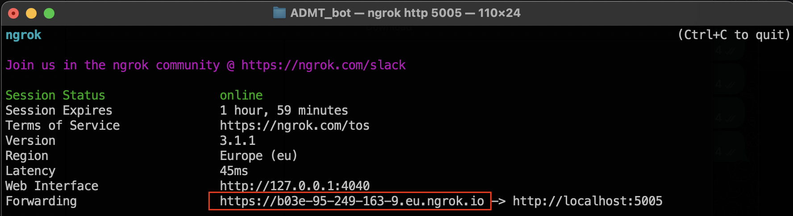
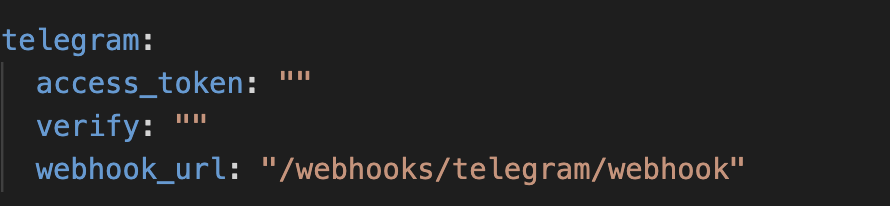
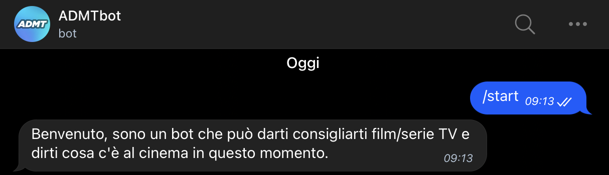
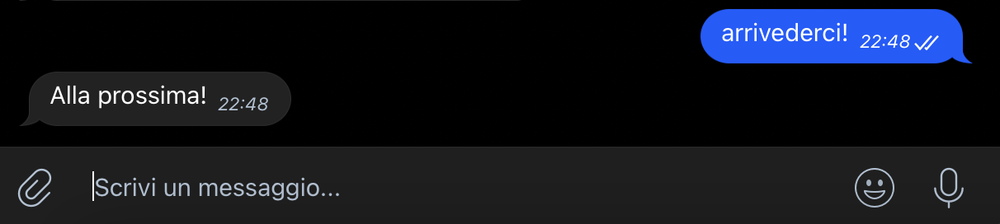
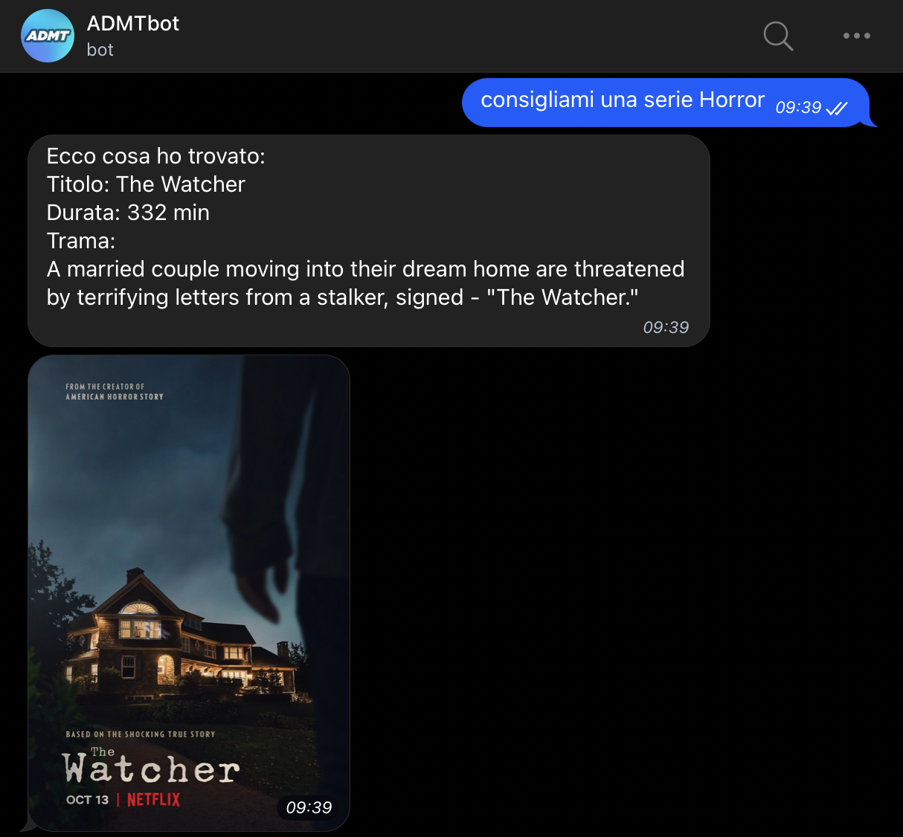
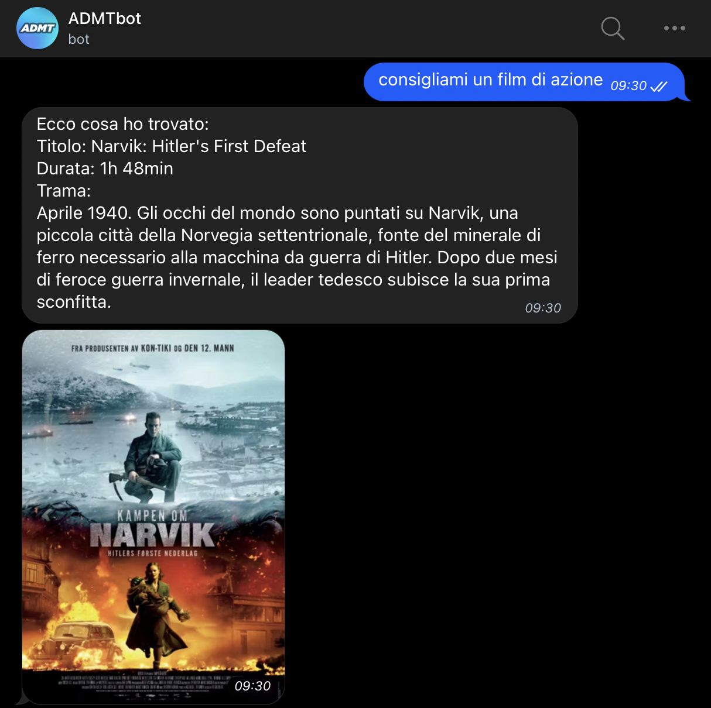
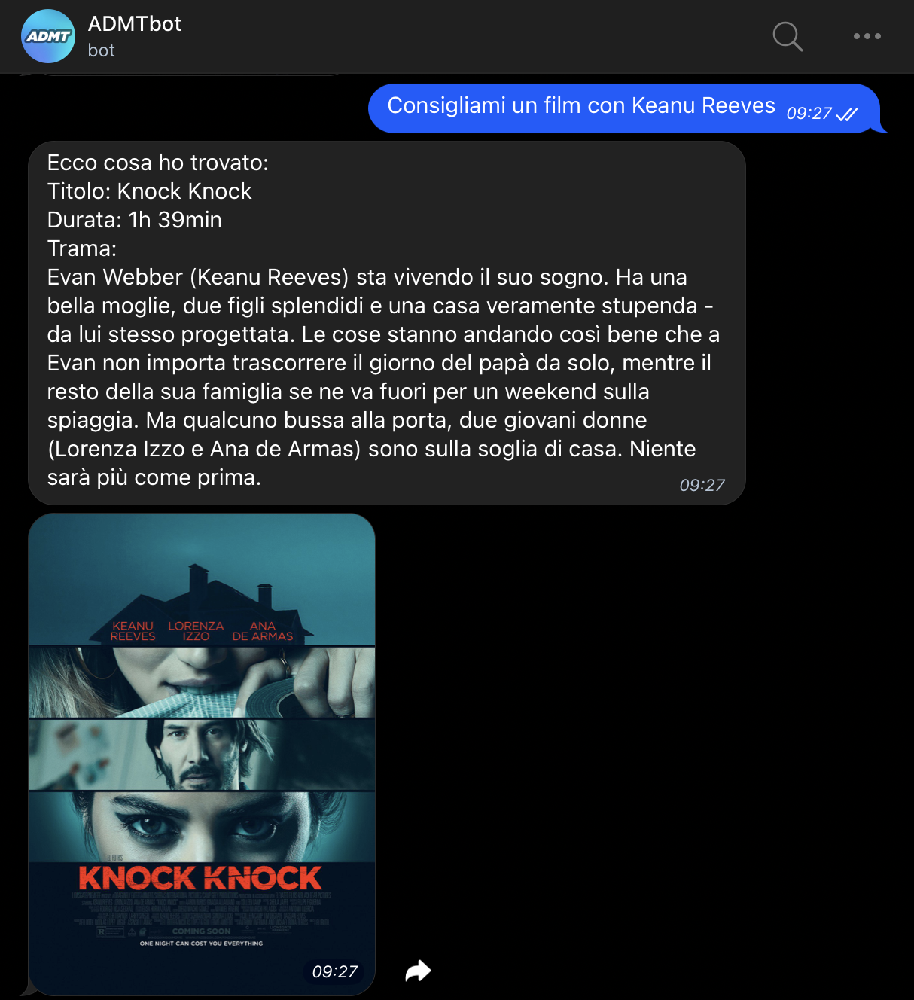
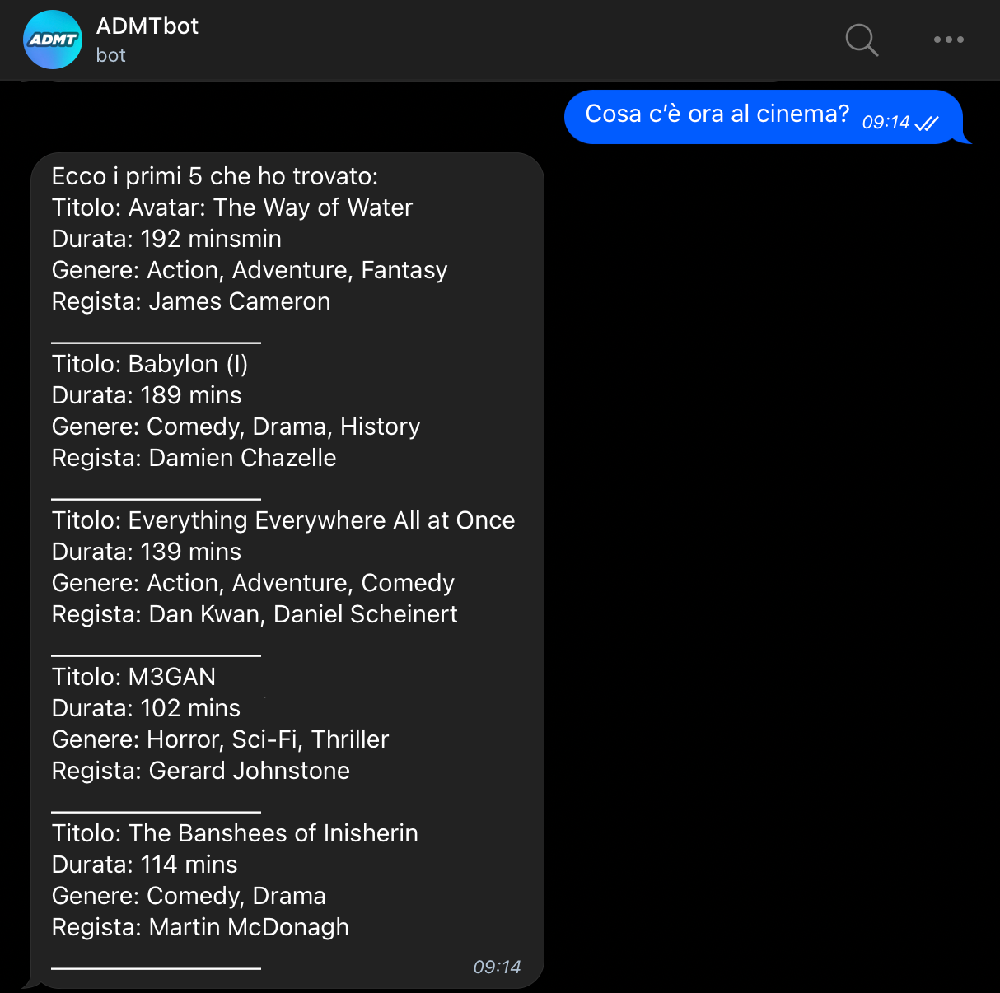
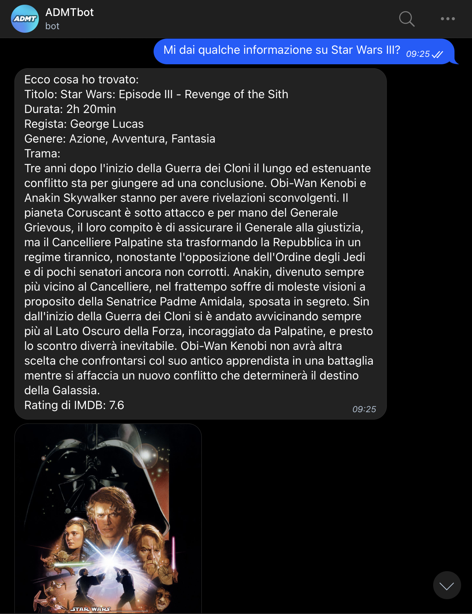

# ADMTbot

ADMTbot è un chatbot sviluppato con il framework Rasa. 
Esso è in grado di:
- consigliare film specificando un attore o un genere;
- consigliare serie tv specificando un genere;
- fornire informazioni su un film specificando il titolo;
- fornire informazioni sui primi cinque film presenti al cinema.

# Configurazione

Requisiti:
- Python 3.8;
- Rasa;
- ngrok.

Per installare Rasa è necessario eseguire da terminale: 
``pip install rasa``

Dopodichè, per avviare il chatbot è necessario eseguire da terminale nella cartella di progetto: 
``rasa train | rasa run``

Per configurare un bot su Telegram, è necessario avere un account e interagire con il bot ufficiale, <a href="https://telegram.me/botfather">BotFather</a>. 

Per collegare il chatbot Rasa con il bot Telegram è necessario modificare il file *credentials.yml*, inserendo i propri *access_token* e *verify*. 

Per avviare ngrok, è necessario eseguire da terminale nella cartella di progetto: 
`ngrok http 5005`
  

Copiare il *webhook_url* (parte evidenziata nell'immagine), come prefisso nella corrispettiva voce del file *credentials.yml*.
  

Per rendere disponibili le *actions*, è necessario eseguire in una nuova finestra del terminale: 
``cd actions``
``rasa run actions``

Dopodichè, cercando il proprio bot su Telegram è possibile iniziare a chattare.

# Casi d'uso
Messaggio di benvenuto.
  

Messaggio di arrivederci.
  

L'utente chiede al chatbot di consigliare una serie tv specificando un genere, in mancanza, viene chiesto di riprovare;
  

L'utente chiede al chatbot di consigliare un film di specificando un genere, in mancanza, viene chiesto di riprovare;
  

L'utente chiede al chatbot di consigliare un film specificando un attore, in mancanza viene chiesto di riprovare;
  

L'utente chiede al chatbot cosa c'è al cinema, il chatbot restituisce i primi cinque film proiettati nelle sale nel periodo corrente;
  

L'utente chiede al chatbot informazioni aggiuntive di un film specificando il titolo, in mancanza viene chiesto di riprovare;
  
